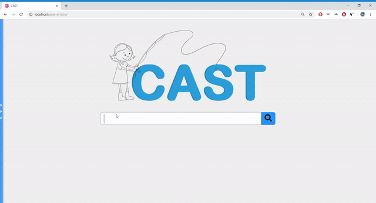
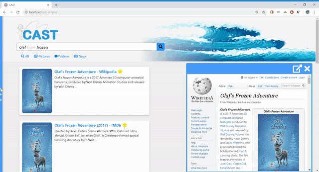
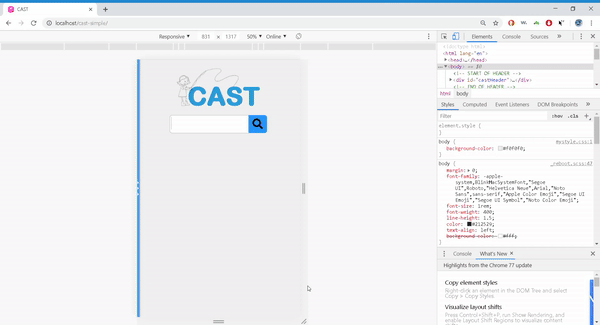

# CAST Search Engine
CAST is a children's search engine designed to make searching on the web easier for kids K-4th grade. Each search word is filtered through a profanity filter, readability and reliability sorter, phonetic spell checker, and other classes to allow the best search possible. 

In the example above, unnecessary words are put in light gray so users know what terms the search engine used. This helps kids learn how to make an efficient search. For example, a child might search "what is the name of the cute snowman from frozen?". The function would gray out multiple words leaving "name" of "snowman frozen". This helps children learn not to type full sentences and improve their search for next time.

If a word is misspelled, the word will appear in red with a bar of suggestions below it. Using a custom phonetic spell checker, a list of options will appear below. When hovered over, the word will be read allowed along with a small picture of what that word means. 

When the user hover over a website, a small preview will appear (from scraping front end) which allows the student to check if this it is what they were looking for before browsing the sight. This can help students find the same website from a teacher or previously used website more easily. Searches glow in light blue when hovered over to help the user not lose sight of the cursor or lose focus.

Additionally, children can star the searches that they found the most helpful. The website will remain starred for the next searches until the student exits the search session. 

Images, Videos, and news can also be viewed by clicking on the bar below CAST. On the admin page, teachers can view searches made by their students, the number of searches, and do replays of a students search in order to make sure the student is on task or see where they got lost or confused. 

# Personal Contributions:
tldr: Created beta readability sorter, toolbar, image and video pages, responsive format, and spell checker w/ tester.

Beta readability/ reliability sorter: Before the readability sorter, pages that were incredibly difficult to read or irrelevant for kids would often appear. For example, when typing "Saturn", the first first result would often be for a jeans company or an academic paper about saturn. In order to combat this, I scraped the front end code, filtered out everything that wasn't raw text (i.e. html), counted the number of words per sentence, the average length of words per sentence, number of sentences for the page, and multiple other factors. After sorting through this, each factor would be weighted and summed up. Scores with lower numbers (indicating fewer words per sentence, shorter words, etc) would be pushed to the top of the array. Additionally, sights that were educational were pushed forward as students would typically be looking for a .org sight (i.e. wikipedia) instead of a seller. This was done by factoring ".com" sights lower in the array. This will be scrapped in the final version of CAST in favor of an ML version, but the proof of concept was made from this.

Images/Videos/Toolbar: The image page was created by taking image links from the google api supplied results, filtering links through the profanity filter, and pasting each into a responsive bootstrap image class, and pasting. For screen widths less than 720px, fewer images were displayed per row. For videos, Youtube API was used to create a search, get results, and post search results. Similar to the image page, results were posted into a responsive grid and changed based on the screen size. For now, we stuck with 3 images for large screens while users are previewing a web page. This may be up to change as CAST is still exploring the ethics of scraping web pages. 

Phonetic Spell Checker & Tester: Originally, our search engine was using Hunspell. Due to high inaccuracy with children's search results, we decided to create a phoenetic spell checker. As children tend to spell words phoentically, we saw an 80% increase in accuracy compared to Hunspell and a shorter response time (30% faster). The spell checker relied on an open source phoentic program which borke down words into thier sound counter parts. By altering this program to optimize for speed and recreating it in spell checker form, we were able to completely build a phoenetic spell checker. For testing, we compared Hunspell and our phoentic spell checker against the top 1000 mispelled words and data we had retrieved from mispelled words in children's searches through Beta trials. This allowed us to see the full impact of our code.

Responsive format: All pages were adjusted to fit the screen size. This was done by changing CSS to Bootstrap and using responsive classes. Please see the gif below. 

The code provided is a very small sample of the code I regularly worked with and created. Permission to make public granted by from Downs at Boise State University. 
